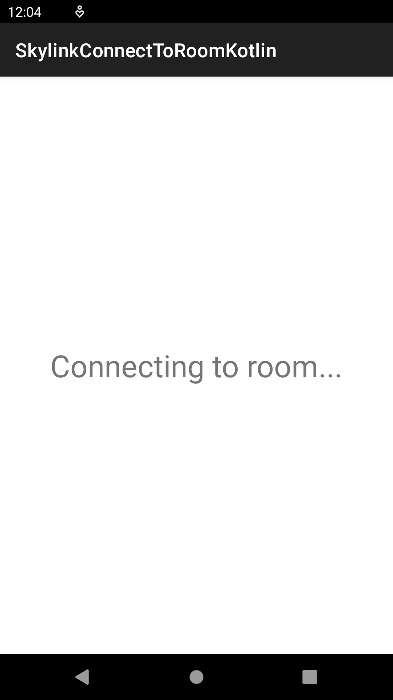

# Skylink Android SDK - `connectToRoom` API

### How to wait for Skylink room connection in a background thread using `Kotlin coroutines`

``` kotlin
override fun onResume() {

    mTV.text = "Connecting to room..." // UI update

    // Connect to Skylink room
    mSkylinkConnection.connectToRoom("Skylink Key ID comes here",
        "Skylink Key secret comes here",
        "Room name comes here",
        "Username of connecting peer comes here",
        object : SkylinkCallback {
            override fun onError(skylinkError: SkylinkError, hashMap: HashMap<String, Any>) {
                // Handle Skylink room connection error
            }
        }
    )

    // Create a coroutine to move the execution off the main thread to an IO thread
    CoroutineScope(Dispatchers.IO).launch {
        // Wait until connected to Skylink room
        while (mSkylinkConnection.skylinkState != SkylinkConnection.SkylinkState.CONNECTED) {
            delay(500)
        }
        val skylinkState = mSkylinkConnection.skylinkState.toString()

        // New coroutine to update UI from the main thread
        CoroutineScope(Dispatchers.Main).launch {
            mTV.text = skylinkState // UI update to displays "CONNECTED"
        }
    }

}
```

Screenshots of running app.


